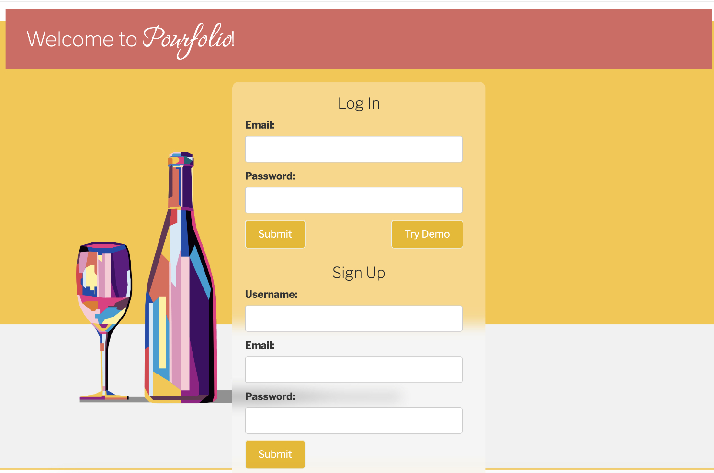

# Pourfolio
Pourfolio is wine cellar tracking application. It offers users the ability to create aging schedules, take tasting notes, and review historical tasting data.

A bit of history here - about a year ago, during our honeymoon in France, my husband and I selected some of our favorite wines with the intention of aging them to enjoy on future anniversaries. Initially, we used individual tags to mark the years we planned to drink each bottle... but that ended up being a mess - tags everywhere!

To solve this problem, I developed Pourfolio as a fun, personal project. The app is designed to store aging schedules and tasting notes in one convenient place. This way, whether it’s 10, 20, or even 30 years from now, we can open the exact bottle we intended, and effortlessly add new tasting notes while reviewing those from previous years.
Curious about what people have to say? Take a look now at the [live site](https://www.pourfolio.com)!



## Features

All site visitors are able to either create their own account, or take a spin on our "Demo User" account to have a look around.  

Key Features:

- User Account Management: Users can create accounts and log in to access their personal wine cellars.
- Cellar Management: Users can view, search, and filter their wine cellars, making it easy to organize and view their collections.
- Wine Addition and Tracking: Users can add new bottles to their cellars, set up aging schedules, and track consumption with detailed tasting notes for each bottle.
- Tasting Note Review: Users can access and review all tasting notes associated with a specific wine, allowing for comparisons and historical tracking.
- Vineyard Management: Users have the capability to create and edit information about vineyards.


## Technologies

Pourfolio has a backend framework of Python, Flask, Jinja, and SQLAlchemy; using a PostgreSQL database.  Its frontend is Javascript and React, as well as some Bootstrap.  

## Special Features

### React

```javascript 
    code snippet
```


### Ajax


```javascript 
    code snippet
```


## Coming Soon!!  
- Users can grant other users access to their cellar
- Pourfolio is currently in transiotion to become a full React app. 

# Thanks for visiting!  
Feel free to [get in touch](https://www.heyimhelen.com)!
